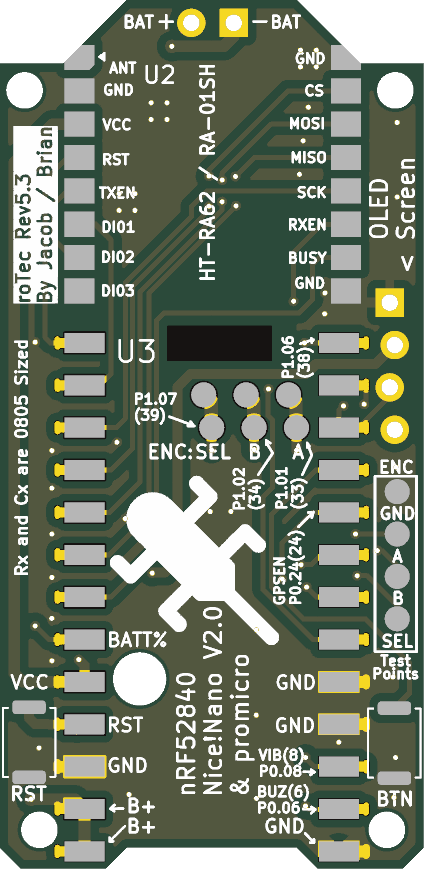
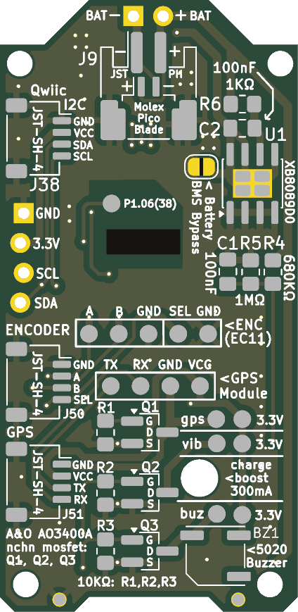

# roTec_pcb

| Front                               | Back                              |
|:------------------------------------|:----------------------------------|
|  |  |

## Design Documentations

* [Schematic as pdf](./documentation/roTec_schematic.pdf)
* [Schematic Bill Of Materials](./documentation/roTec_bom.csv)

* You may also want to manufacture [EC11 Rotary Encoder Horizontal Breakout Board](https://github.com/mofosyne/kicad_useful_pcbs/tree/main?tab=readme-ov-file#ec11-horizontal-breakout-board), so you can more easily wire the rotary encoder to the roTec via a JST-SH-4 cable.
