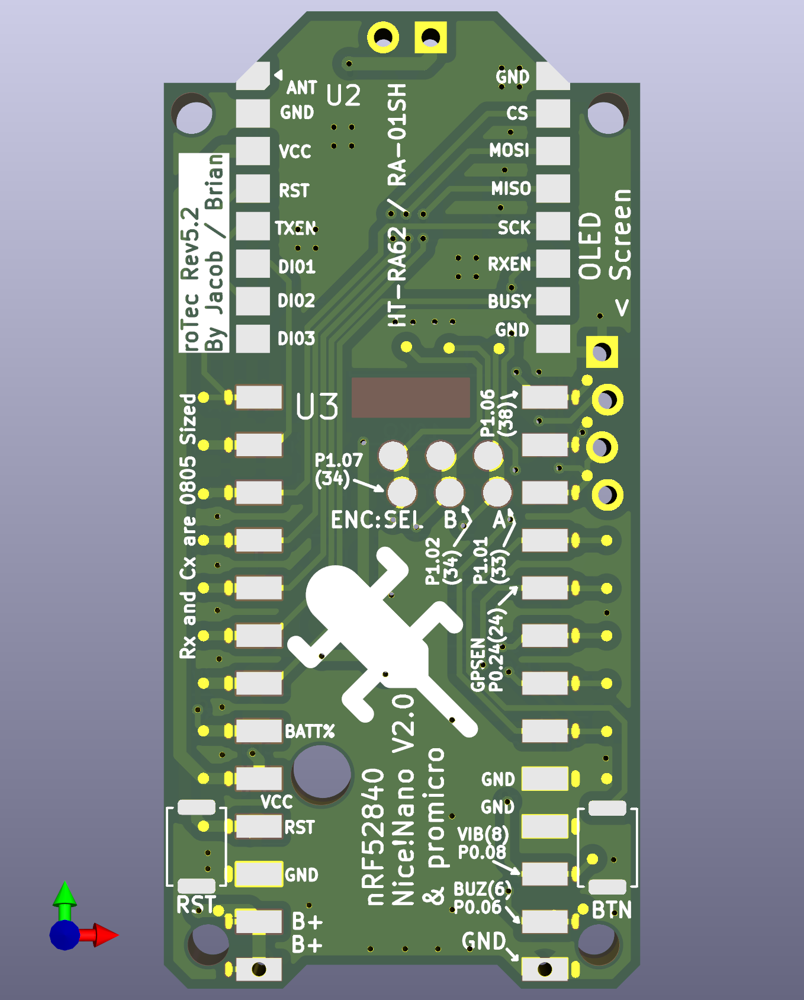
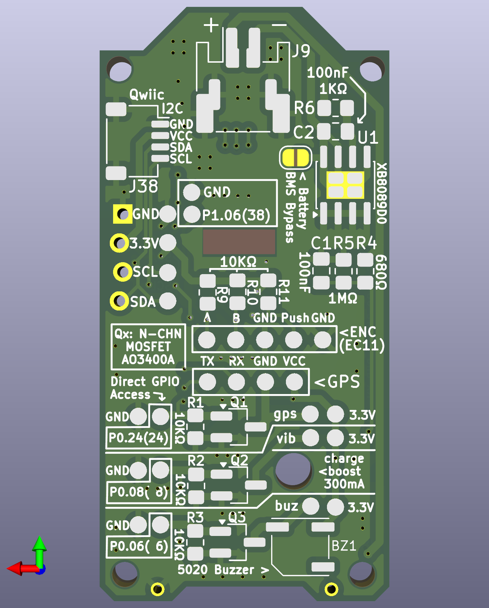
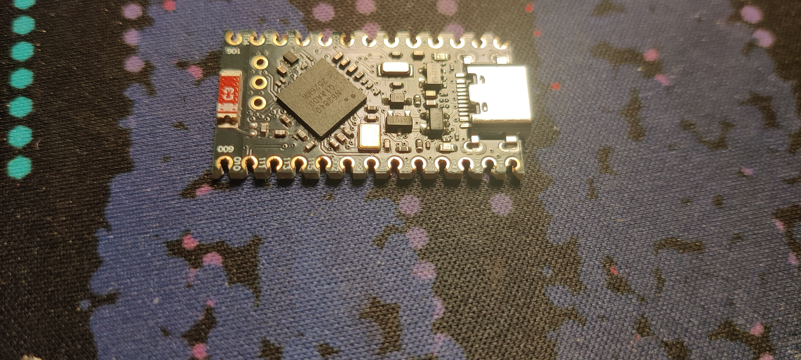

# fakeTec_pcb
My personal modification of the fakeTec, a low-cost nRF52 device with the form-factor of the Heltec v2, v3, & v4 devices 
compatible with [Meshtastic](https://meshtastic.org/)®.

This design is specifically based off of [Šimon Hořánek's](https://github.com/ShimonHoranek) 
[fakeTec V5 Rev. B](https://github.com/gargomoma/fakeTec_pcb/issues/24), licensed under 
[CERN-OHL-P-2.0](https://choosealicense.com/licenses/cern-ohl-p-2.0/).

Further inspiration has been taken from [Brian's Fork, the roTec](https://github.com/mofosyne/roTec_pcb), an alternative
board with greatly expanded wiring options and extra on-board guidence.

# Pictures
| Front                               | Back                              |
|:------------------------------------|:----------------------------------|
|  |  |

# Schematic

Schematic and component list

Note this list is for the v5.5.1

| Component Ref | Value     |
|:------------- |:--------- |
| C1, C2        | 100nf     |
| Q1, Q2, Q3    | AO3400A*  |
| R1, R2, R3    | 10K       |
| R4            | 680K      |
| R5            | 1M        |
| U1            | XB8089D0  |
| U2            | HT-RA62   |
| U3            | nice!nano |

\* Can be any SOT-23 logic level MOSFET that supports atleast 3v

## Features
- Small size based on Heltec v3: You can use the same cases!
- Lora with Heltec's HT-RA62
- Uses a [n!cenano](https://nicekeyboards.com/nice-nano/) or 
  [NRF52840 ProMicro](https://github.com/joric/nrfmicro/wiki/Alternatives#supermini-nrf52840l)
- BMS For low voltage cutout to prevent LiPo Overdraining
- Battery level sensing
- JST PH2.0mm connector for batteries
- I2C side ports ready to connect an OLED SSD1306 screen.
- Pads for connecting an encoder for canned messages
- A pad exposing P1.06 (38) for misc use
- Pads for connecting a serial GPS module
- MOSFETs for switching high current components
- 2mm mounting holes
- Mostly clear edges for mounting

## Modifications from fakeTec V5 Rev. B
- Cleaned up schematic
  - Changed Pins representing sides of MCUs to symbols fully representing said MCU
  - Changed labels to my preferred naming scheme
- Setup netclasses
- Shifted pads `P1.01`, `P1.02`, and `P1.07` to where I'm pretty sure they're supposed to be
  - I also added two sets as the NRF ProMicro and the Nice!Nano appear to have them in different places.
- Removed jumper for BMS
  - I will always install a BMS
- Removed jumper for GPS/FET1 Drain to FET1
  - Only one will be connected at a time, probably no difference if this is permanently connected to both
- Switched mosfets to AO3400A
  - I already have these and they're a drop in replacement
- Changed all resistors and Capacitors to 805 sized
  - I already have all the resistors in this size
- Removed debouncing capacitors and pull-up resistors from the buttons
  - [User mofosyne](https://github.com/mofosyne) provided evidence that it is unnecessary 
    [here](https://github.com/gargomoma/fakeTec_pcb/issues/64)
- Added ground pads to rotary encoder pads
- Added access to P1.06 for misc usage next to rotary encoder pads
- Changed battery connector to a JST PH-2.0mm
  - PH-2.0mm are also apparently more reliable
- Removed lots of silkscreen text
  - Don't need values or component names, just component references
  - Most of it was overlapping
- Moved BMS to side
  - Keeps it out the way of the battery connector
- Added a lot more stitching between front and back ground planes
- Removed vias from on top of silkscreen and off of pads
- Attempted to reduce layer crossings

# Firmware

| Version      | Lora Modules                     | Official Repo link                                                                                                                                          | Unofficial Repo link                                                                                                                                                                |
|:-------------|:---------------------------------|:------------------------------------------------------------------------------------------------------------------------------------------------------------|:------------------------------------------------------------------------------------------------------------------------------------------------------------------------------------|
| With TCXO    | EByte E22/E220-xxxM-22S/HT-RA62  | <a href="https://github.com/meshtastic/firmware/tree/master/variants/nrf52840/diy/nrf52_promicro_diy_tcxo" target="_blank">Official repo - With TCXO</a>    | <a href="https://github.com/mrekin/MeshtasticCustomBoards/tree/main/firmware/variants/nrf52840/diy/promicro_diy_m" target="_blank">With TCXO</a> @mrekin/MeshtasticCustomBoards     |
| Without TCXO | EByte E22/E220-xxxMM-22S/RA-01SH | <a href="https://github.com/meshtastic/firmware/tree/master/variants/nrf52840/diy/nrf52_promicro_diy_xtal" target="_blank">Official repo - Without TCXO</a> | <a href="https://github.com/mrekin/MeshtasticCustomBoards/tree/main/firmware/variants/nrf52840/diy/promicro_diy_mm" target="_blank">Without TCXO</a> @mrekin/MeshtasticCustomBoards |

> If you don't want to build your own image use <a href="https://flasher.meshtastic.org/" target="_blank">the official web flasher</a>. Select the `NRF52 Pro-micro DIY` under `Community Supported Devices` as your target device.

# Device Setup
After you've set up your device, there are a few things you can do in the config to tune it

## Battery ADC Multiplier
The default ADC multiplier for the DIY NRF52 Promicro firmware is slightly off at about `1.85`, due to this design using
a slightly differnt voltage divider, I found that mine is more accurate with a value of `1.68`.  
You should of course still tune yours further with https://meshtastic.org/docs/configuration/radio/power/#calibration-process-attribution

# Bill of materials
| Part                           | Source                                                                                                                                      | Note                                                                                                      |
|:-------------------------------|:--------------------------------------------------------------------------------------------------------------------------------------------|:----------------------------------------------------------------------------------------------------------|
| NRF52840 ProMicro or n!icenano | [AliExpress](https://www.aliexpress.com/item/1005006446457448.html)  [niceKeyboards](https://nicekeyboards.com/nice-nano/#find-a-store) |[Please read it before buying red ProMicros](https://github.com/gargomoma/fakeTec_pcb/issues/30)           |
| HT-RA62                        | [Heltec](https://heltec.org/project/ht-ra62/)  [AliExpress](https://www.aliexpress.com/item/1005005543917617.html)                      | I'd get it directly from heltec                                                                           |
| XB8089D0 BMS                   | [LCSC](https://www.lcsc.com/product-detail/C2760005.html)                                                                                   |                                                                                                           |
| 3x AO3400A MOSFETs             | [LCSC](https://www.lcsc.com/product-detail/C347475.html)  [AliExpress](https://www.aliexpress.com/item/1005007115799728)                | Quite frankly, any logic level N-Channel MOSFET with a `SOT-23` footprint that takes at least 5v will do. |
| SMD JST PH2.0mm Socket         | [LCSC](https://www.lcsc.com/product-detail/C295747.html)  [LCSC](https://www.lcsc.com/product-detail/C7429689.html)                     |                                                                                                           |
| SMD 805 Resistors              |                                                                                                                                             | You'll need 1x 1k, 3x 10K, 1x 680K, 1x 1M                                                                 |
| SMD 805 Ceramic Capacitors     |                                                                                                                                             | You'll need 2 x 100nF                                                                                     |
| 2x smd Button                  | [LCSC](https://www.lcsc.com/product-detail/C41427500.html)                                                                                  | You want something around 4 x 3 x 2                                                                       |
| OLED SSD1306 i2c (optional)    | [AliExpress](https://www.aliexpress.com/item/1005005970901119.html)                                                                         |                                                                                                           |
| Battery connection (optional)  | [AliExpress](https://www.aliexpress.com/item/1005002564191148.html)                                                                         | This is an example.                                                                                       |
| Glue Stick Sprint Antenna      | [AliExpress](https://www.aliexpress.com/item/1005008671071222.html)                                                                         |                                                                                                           |
| Antenna (Recommended           | [AliExpress](https://www.aliexpress.com/item/1005004607615001.html)                                                                         |                                                                                                           |
| Antenna pigtail (recommended)  | [AliExpress](https://www.aliexpress.com/item/4001287491018.html)                                                                            | It may underperformed with a cheap black pigtail.                                                         |
| PCB                            |                                                                                                                                             | Use your favourite company to get the PCB. I use [JLCPCB](https://jlcpcb.com/)                            |

# Troubleshooting
## Cannot write the firmware to the Microcontroller
It appears that many NRF ProMicros on AliExpress come with an older version of the bootloader which doesn't support
uf2 files that are larger than 512KB.
The steps to fix are detailed in [this github issue](https://github.com/meshtastic/firmware/issues/7091), of which were
taken from [this older FakeTec Guide](https://adrelien.com/blog/diy-meshtastic-how-to-build-your-own-meshtastic-device-with-faketec-pcb-nrf52840/#step-1-update-the-bootloader).  
They're also copied below for convenience:
1. Connect the node to your PC using a data cable
2. Put the node into DFU (Device Firmware Update) mode by shorting the GND and Reset pins once or twice, A new drive 
   should appear on your computer
3. Check the INFO_UF2.TXT file to determine your current bootloader version
4. Visit Adafruit's GitHub page for nRF52 Bootloader releases
5. Find the next release after your current version (you must update incrementally)
6. Download the nice_nano_bootloader-X.X.X.HEX and nice_nano_bootloader-X.X.X.UF2 files for your board
7. Drag and drop the .HEX file onto the drive first, then the .UF2 file
8. The device will disconnect and restart
9. Check the bootloader version again and repeat if necessary until you reach the latest version

My ProMicros arrived at version 6.0.0, and I only updated to 0.6.3 as it started working at that version and it looked
like a long process to go to the latest version.

## The Microcontroller isn't getting power/The microcontroller can't connect the battery/The microcontroller can't connect to the LoRa module/The buttons don't work
The micro controller is pretty difficult to solder to the pads through the through holes, it took me many attempts to
get it right.

Make sure you check each connection using a multimeter before you decide you've finished soldering.

If you're really struggling, you can use a fine file to turn the through holes into castellated edges.
 
Be careful though, fibreglass shards are not good for your lungs

## The battery isn't working
Double check which way round your battery connector is wired. The batteries I bought were wired the opposite way to the
connector on the board.

# About Meshtastic
[Meshtastic](https://meshtastic.org/)® is a registered trademark of Meshtastic LLC. Meshtastic software components are released under various licenses, see github for details.

# Disclaimer
No warranty is provided.
You use it at your own risk and take the responsibility upon yourself.
